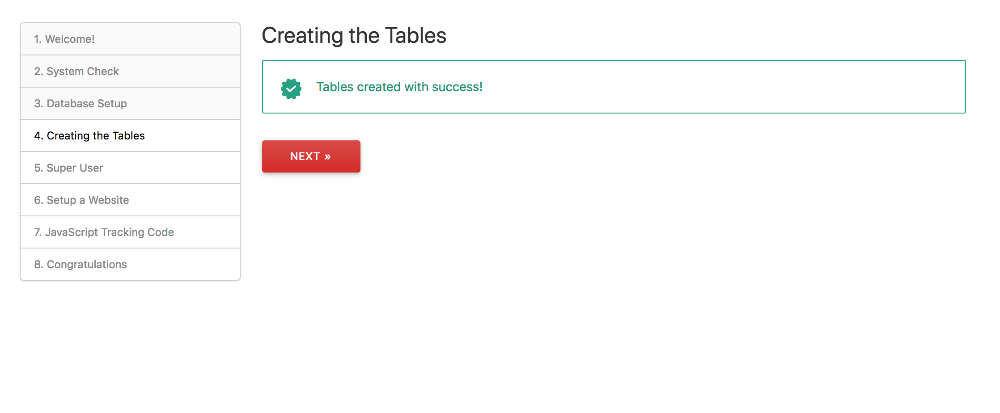
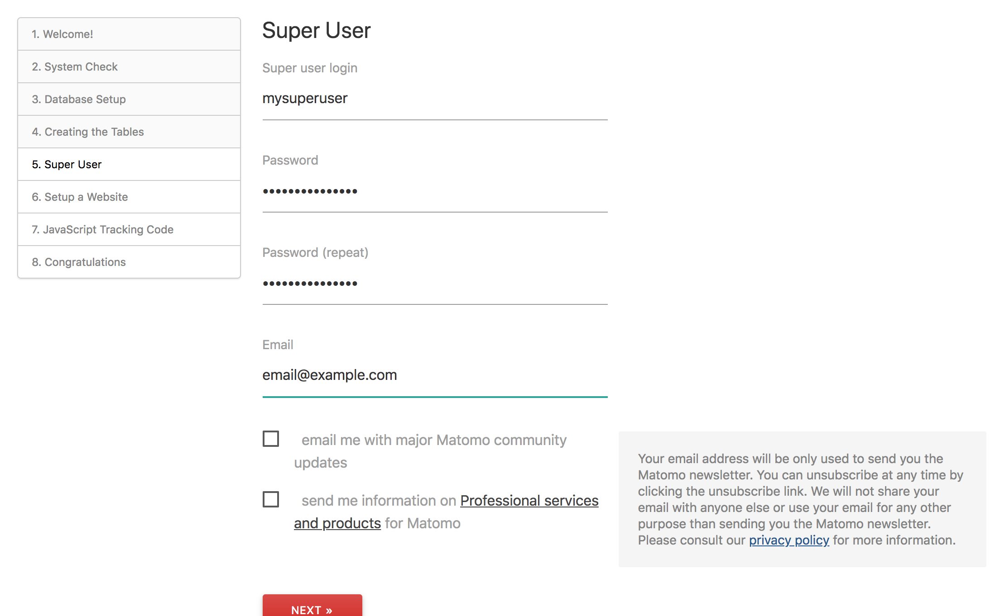
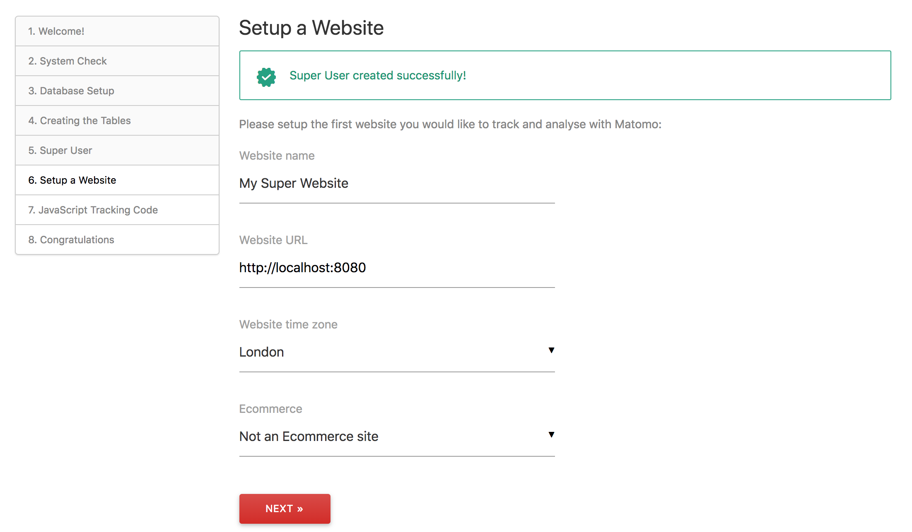
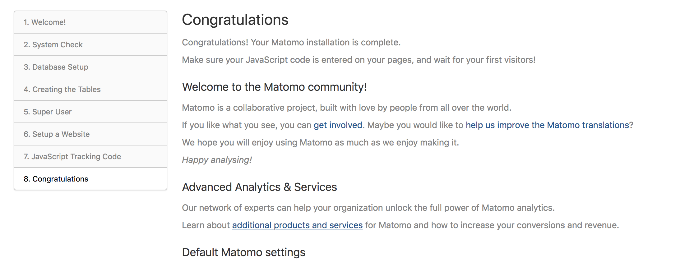

# What this includes

- docker composer for local development of website using matomo which includes an _nginx reverse proxy_ container, a _matomo_ container and a _mariadb_ database container
- prepared config.ini.php file to skip installation after first run
- nginx container which includes libmaxminddb and a compiled version of nginx geoip2 as a dynamic module
- nginx config which denies access to the most common file types used for hacking

Instructions for local and AWS ECS install are in their respective folders.

# Code to add to header of the pages you want to track

```
<!-- Matomo -->
<script type="text/javascript">
  var _paq = _paq || [];
  /* tracker methods like "setCustomDimension" should be called before "trackPageView" */
  _paq.push(['trackPageView']);
  _paq.push(['enableLinkTracking']);
  (function() {
    var u="//stats.example.com:8080/";
    _paq.push(['setTrackerUrl', u+'piwik.php']);
    _paq.push(['setSiteId', '1']);
    var d=document, g=d.createElement('script'), s=d.getElementsByTagName('script')[0];
    g.type='text/javascript'; g.async=true; g.defer=true; g.src=u+'piwik.js'; s.parentNode.insertBefore(g,s);
  })();
</script>
<!-- End Matomo Code -->
```

OR
- WordPress Plugin: http://wordpress.org/extend/plugins/wp-piwik/
- Log reader: https://matomo.org/docs/tracking-api/
- CloudfFare App: https://www.cloudflare.com/apps/piwik

#Steps for install









